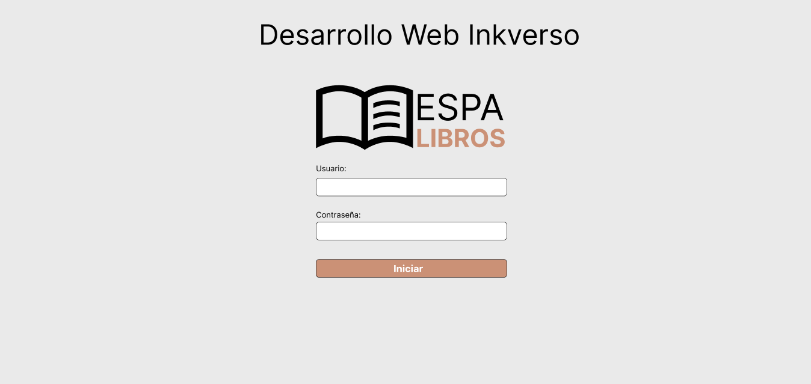
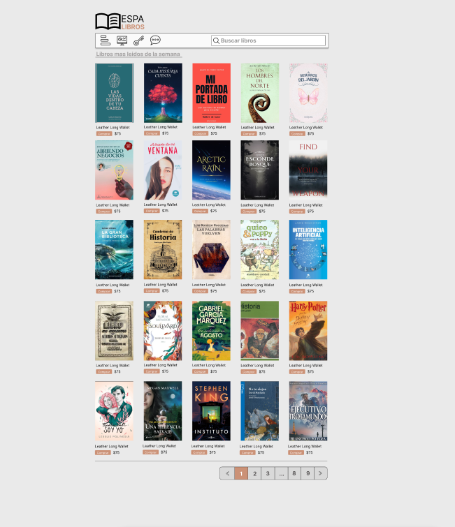
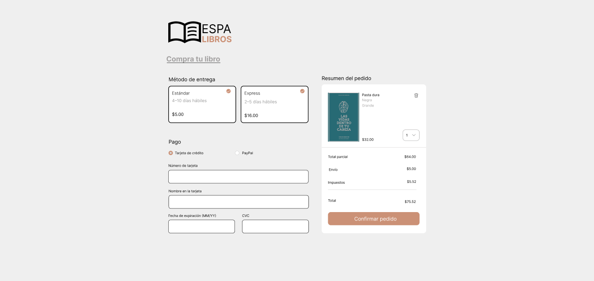

# Proyecto ESPA LIBROS

Este repositorio contiene el desarrollo de la aplicación web **ESPA LIBROS**, que permite a los usuarios registrarse, navegar por un catálogo de libros, gestionar un carrito de compras y completar el proceso de pago.

---

## 🗓️ Cronograma

| Fase                                                              | Inicio              | Fin                 | Estado     | Hito                |
| ----------------------------------------------------------------- | ------------------- | ------------------- | ---------- | ------------------- |
| Enunciado del Proyecto: Desarrollo Web Inkverso                   | 31 de marzo de 2025 | -                   | -          | Inicio del proyecto |
| Primera revisión (hito)                                           | -                   | 3 de mayo de 2025   | -          | Hito 1              |
| Wireframes y prototipos (Figma)                                   | 4 de abril de 2025  | 17 de mayo de 2025  | En proceso |                     |
| Estructura HTML/CSS – Tailwind (index, home, checkout)            | 15 de abril de 2025 | 31 de mayo de 2025  | En proceso |                     |
| Modelo conceptual de BD (PostgreSQL & MongoDB)                    | 18 de abril de 2025 | 6 de junio de 2025  | En proceso |                     |
| Segunda revisión (hito)                                           | -                   | 7 de junio de 2025  | -          | Hito 2              |
| Estructura HTML/CSS – Tailwind (detalleLibro, carrito, panelCRUD) | 15 de abril de 2025 | 14 de junio de 2025 | Finalizado |                     |
| Componentes React & React Router                                  | 8 de mayo de 2025   | 25 de junio de 2025 | Finalizado |                     |
| Modelo de datos y migraciones BD                                  | 18 de abril de 2025 | 20 de junio de 2025 | Finalizado |                     |
| Tercera revisión (hito)                                           | -                   | 5 de julio de 2025  | -          | Hito 3              |
| Desarrollo Backend (endpoints CRUD, auth, pagos)                  | 10 de mayo de 2025  | 30 de junio de 2025 | Finalizado |                     |
| Integración Front-Back & pruebas unitarias                        | 15 de mayo de 2025  | 1 de agosto de 2025 | Finalizado |                     |
| Testing end-to-end y QA                                           | 1 de julio de 2025  | 2 de agosto de 2025 | Finalizado |                     |
| Despliegue (Vercel, CI/CD)                                        | 28 de julio de 2025 | 2 de agosto de 2025 | Finalizado |                     |
| Documentación técnica y video explicativo                         | 1 de agosto de 2025 | 3 de agosto de 2025 | Finalizado |                     |
| Entrega final (hito)                                              | -                   | 3 de agosto de 2025 | -          | Entrega final       |

---

## 📁 Estructura del Proyecto

```
.
├── carrito.html          # Vista del carrito de compras
├── checkout.html         # Proceso de compra
├── detalleLibro.html     # Detalle de cada libro
├── home.html             # Página principal tras iniciar sesión
├── index.html            # Página de login
├── js
│   └── script.js         # Lógica y eventos en JavaScript
├── panelCRUD.html        # Panel de administración CRUD
├── doc
│   ├── index.png         # Mockup de Login (Figma)
│   ├── home.png          # Mockup de Home (Figma)
│   └── checkout.png      # Mockup de Checkout (Figma)
└── README.md             # Documentación del proyecto
```

---

## 🎨 Diseño en Figma

A continuación se incluyen los prototipos realizados en Figma:

* **Login:**
  

* **Home (Catálogo de Libros):**
  

* **Checkout (Compra):**
  

---

## 💻 JavaScript

La carpeta `js/` contiene el archivo `script.js`, donde se implementa la lógica de interacción del usuario, validaciones y llamadas a la API.

```bash
js/
└── script.js    # Funciones de carrito, filtros y manejo de eventos
```

---

## 🛢️ Base de Datos SQL - PostgreSQL

Se está trabajando en el modelo relacional con tablas y llaves para soportar usuarios, libros y pedidos.

| Tabla          | Campo              | Tipo          | PK / FK             | Descripción                                       |
| -------------- | ------------------ | ------------- | ------------------- | ------------------------------------------------- |
| usuarios       | usuario\_id        | INT           | PK (auto-increment) | Identificador único de cada usuario               |
|                | nombre             | VARCHAR(100)  |                     | Nombre completo                                   |
|                | email              | VARCHAR(150)  | UNIQUE              | Correo electrónico                                |
|                | contraseña         | VARCHAR(255)  |                     | Hash de la contraseña                             |
|                | fecha\_registro    | TIMESTAMP     |                     | Fecha y hora de creación de la cuenta             |
|                | rol                | VARCHAR(20)   |                     | Rol de usuario (e.g. “admin”, “cliente”)          |
| libros         | libro\_id          | INT           | PK (auto-increment) | Identificador único de cada libro                 |
|                | titulo             | VARCHAR(200)  |                     | Título del libro                                  |
|                | autor              | VARCHAR(100)  |                     | Autor(es)                                         |
|                | descripcion        | TEXT          |                     | Sinopsis o descripción                            |
|                | precio             | DECIMAL(10,2) |                     | Precio unitario                                   |
|                | stock              | INT           |                     | Unidades disponibles en inventario                |
|                | isbn               | VARCHAR(20)   | UNIQUE              | Código ISBN                                       |
|                | fecha\_publicacion | DATE          |                     | Fecha de publicación                              |
| pedidos        | pedido\_id         | INT           | PK (auto-increment) | Identificador único de cada pedido                |
|                | usuario\_id        | INT           | FK → usuarios       | Usuario que realizó el pedido                     |
|                | fecha\_pedido      | TIMESTAMP     |                     | Fecha y hora en que se creó el pedido             |
|                | estado             | VARCHAR(30)   |                     | Estado (pendiente, pagado, enviado, cancelado)    |
|                | total              | DECIMAL(10,2) |                     | Valor total del pedido                            |
| pedido\_libros | pedido\_id         | INT           | PK / FK → pedidos   | Referencia al pedido                              |
|                | libro\_id          | INT           | PK / FK → libros    | Referencia al libro                               |
|                | cantidad           | INT           |                     | Número de unidades de ese libro en el pedido      |
|                | precio\_unitario   | DECIMAL(10,2) |                     | Precio del libro al momento de realizar el pedido |

---

## 🌐 Base de Datos NoSQL - MongoDB

Ejemplos de documentos en MongoDB para las colecciones principales:

### Colección: usuarios

```json
{
  "_id": ObjectId("64a1f9c2e1b2f8a0d1234567"),
  "nombre": "Juan Pérez",
  "email": "juan.perez@example.com",
  "password": "$2b$10$EixZaYVK1fsbw1ZfbX3OXePaWxn96p36djfK",
  "fechaRegistro": ISODate("2025-04-28T14:35:00Z"),
  "rol": "cliente",
  "createdAt": ISODate("2025-04-28T14:35:00Z"),
  "updatedAt": ISODate("2025-04-28T14:35:00Z")
}
```

### Colección: libros

```json
{
  "_id": ObjectId("64a1fa3be1b2f8a0d1234568"),
  "titulo": "El Principito",
  "autor": "Antoine de Saint-Exupéry",
  "descripcion": "Una maravillosa fábula filosófica…",
  "precio": 29.90,
  "stock": 120,
  "isbn": "978-84-376-0494-7",
  "fechaPublicacion": ISODate("1943-04-06T00:00:00Z"),
  "createdAt": ISODate("2025-04-28T14:40:00Z"),
  "updatedAt": ISODate("2025-04-28T14:40:00Z")
}
```

### Colección: pedidos

```json
{
  "_id": ObjectId("64a1fb5de1b2f8a0d1234569"),
  "usuario": ObjectId("64a1f9c2e1b2f8a0d1234567"),
  "fechaPedido": ISODate("2025-05-03T10:15:00Z"),
  "estado": "pendiente",
  "total": 59.80,
  "items": [
    {
      "libro": ObjectId("64a1fa3be1b2f8a0d1234568"),
      "cantidad": 2,
      "precioUnitario": 29.90
    }
  ],
  "createdAt": ISODate("2025-05-03T10:15:00Z"),
  "updatedAt": ISODate("2025-05-03T10:15:00Z")
}
```

---


*Este README.md se irá actualizando según avance el desarrollo, incluyendo nuevas funcionalidades, API endpoints y pruebas.*
