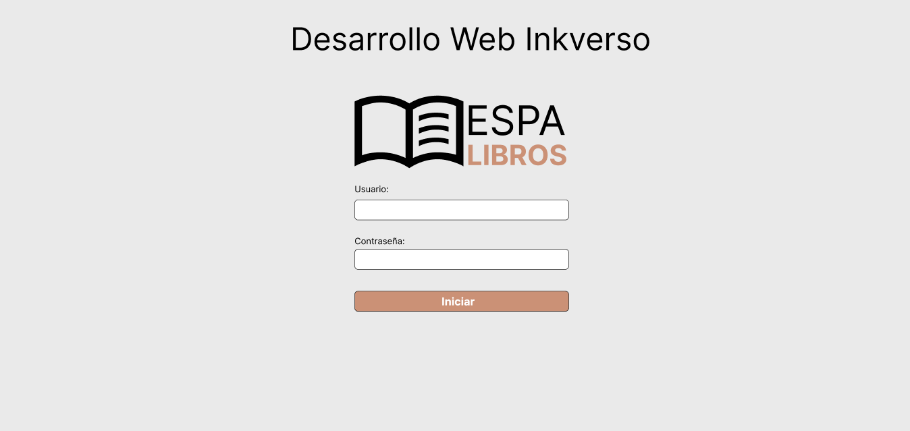
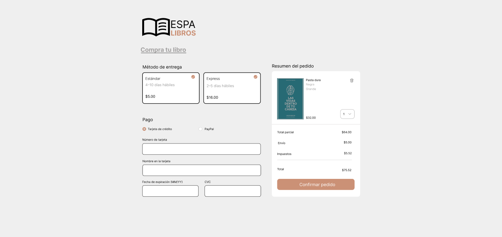
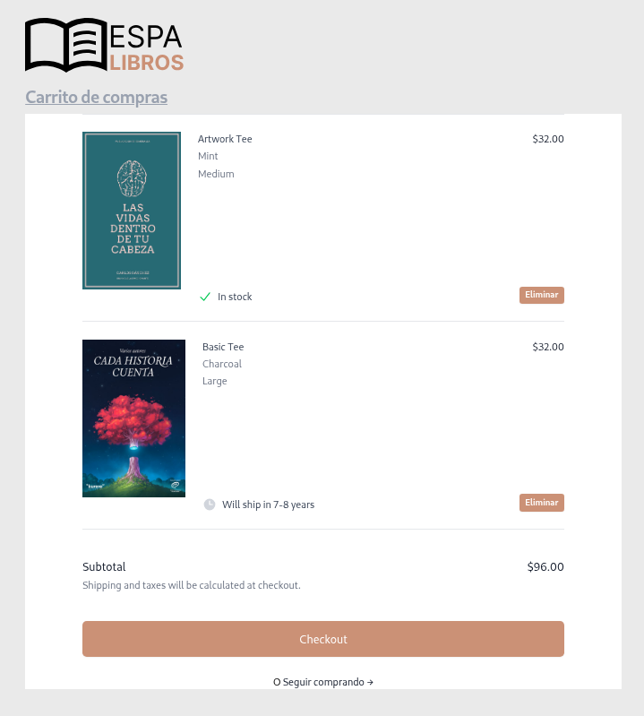
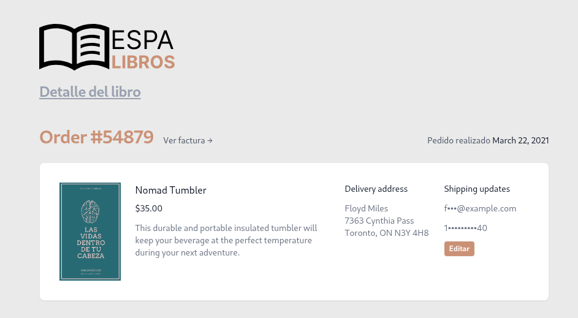
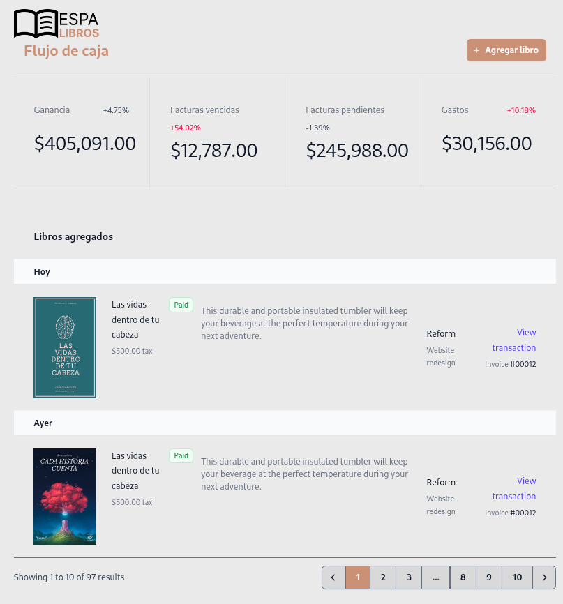
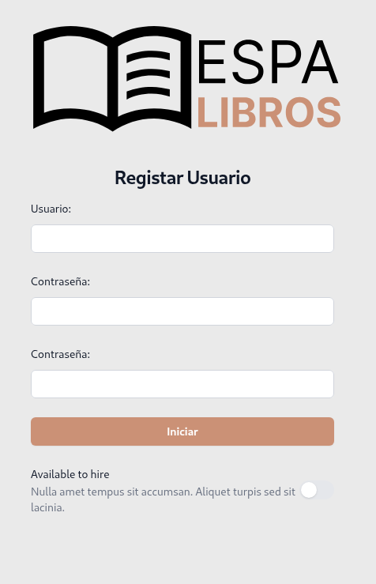

# Proyecto ESPA LIBROS

Este repositorio contiene el desarrollo de la aplicación web **ESPA LIBROS**, que permite a los usuarios registrarse, navegar por un catálogo de libros, gestionar un carrito de compras y completar el proceso de pago.

---

## 🗓️ Cronograma

| Fase                                                              | Inicio              | Fin                 | Estado     | Hito                |
| ----------------------------------------------------------------- | ------------------- | ------------------- | ---------- | ------------------- |
| Enunciado del Proyecto: Desarrollo Web Inkverso                   | 31 de marzo de 2025 | -                   | -          | Inicio del proyecto |
| Primera revisión (hito)                                           | -                   | 3 de mayo de 2025   | -          | Hito 1              |
| Wireframes y prototipos (Figma)                                   | 4 de abril de 2025  | 17 de mayo de 2025  | En proceso |                     |
| Estructura HTML/CSS – Tailwind (index, home, checkout)            | 15 de abril de 2025 | 31 de mayo de 2025  | En proceso |                     |
| Modelo conceptual de BD (PostgreSQL & MongoDB)                    | 18 de abril de 2025 | 6 de junio de 2025  | En proceso |                     |
| Segunda revisión (hito)                                           | -                   | 7 de junio de 2025  | -          | Hito 2              |
| Estructura HTML/CSS – Tailwind (detalleLibro, carrito, panelCRUD) | 15 de abril de 2025 | 14 de junio de 2025 | Finalizado |                     |
| Componentes React & React Router                                  | 8 de mayo de 2025   | 25 de junio de 2025 | Finalizado |                     |
| Modelo de datos y migraciones BD                                  | 18 de abril de 2025 | 20 de junio de 2025 | Finalizado |                     |
| Tercera revisión (hito)                                           | -                   | 5 de julio de 2025  | -          | Hito 3              |
| Desarrollo Backend (endpoints CRUD, auth, pagos)                  | 10 de mayo de 2025  | 30 de junio de 2025 | Finalizado |                     |
| Integración Front-Back & pruebas unitarias                        | 15 de mayo de 2025  | 1 de agosto de 2025 | Finalizado |                     |
| Testing end-to-end y QA                                           | 1 de julio de 2025  | 2 de agosto de 2025 | Finalizado |                     |
| Despliegue (Vercel, CI/CD)                                        | 28 de julio de 2025 | 2 de agosto de 2025 | Finalizado |                     |
| Documentación técnica y video explicativo                         | 1 de agosto de 2025 | 3 de agosto de 2025 | Finalizado |                     |
| Entrega final (hito)                                              | -                   | 3 de agosto de 2025 | -          | Entrega final       |

---

## 📁 Estructura del Proyecto

```
.
```bash
.
├── backend
│   ├── package.json
│   ├── src
│   │   ├── config
│   │   │   └── db.ts
│   │   ├── constants
│   │   │   └── negocio.ts
│   │   ├── controllers
│   │   │   ├── authController.ts
│   │   │   ├── carritoController.ts
│   │   │   ├── libroController.ts
│   │   │   └── pedidoController.ts
│   │   ├── index.ts
│   │   ├── middlewares
│   │   │   ├── adminMiddleware.ts
│   │   │   ├── authMiddleware.ts
│   │   │   ├── logMiddleware.ts
│   │   │   └── validationMiddleware.ts
│   │   ├── models
│   │   │   ├── Carrito.ts
│   │   │   ├── Libro.ts
│   │   │   ├── Notificacion.ts
│   │   │   ├── Pedido.ts
│   │   │   └── Usuario.ts
│   │   ├── routes
│   │   │   ├── admin.ts
│   │   │   ├── auth.ts
│   │   │   ├── carrito.ts
│   │   │   ├── libros.ts
│   │   │   └── pedidos.ts
│   │   ├── services
│   │   │   ├── emailService.ts
│   │   │   └── impuestosService.ts
│   │   ├── types
│   │   │   └── index.d.ts
│   │   └── utils
│   │       └── generarToken.ts
│   └── tsconfig.json
├── Espa-Libros.postman_collection.json
├── frontend
│   ├── app
│   │   ├── app.css
│   │   ├── root.tsx
│   │   ├── routes
│   │   │   ├── BookDetailPage.tsx
│   │   │   ├── CartPage.tsx
│   │   │   ├── CheckoutPage.tsx
│   │   │   ├── HomePage.tsx
│   │   │   ├── LoginPage.tsx
│   │   │   ├── PanelCRUDPage.tsx
│   │   │   └── RegisterPage.tsx
│   │   ├── routes.ts
│   │   └── welcome
│   │       ├── logo-dark.svg
│   │       ├── logo-light.svg
│   │       └── welcome.tsx
│   ├── Dockerfile
│   ├── package.json
│   ├── public
│   │   └── favicon.ico
│   ├── react-router.config.ts
│   ├── README.md
│   ├── tsconfig.json
│   └── vite.config.ts
├── README.md
└── static-html
    ├── carrito.html
    ├── checkout.html
    ├── detalleLibro.html
    ├── doc
    │   ├── carrito.png
    │   ├── checkout.png
    │   ├── detalleLibro.png
    │   ├── home.png
    │   ├── index.png
    │   ├── panelCRUD.png
    │   └── registar.png
    ├── home.html
    ├── img
    │   ├── Captura desde 2025-04-28 16-30-42.png
    │   .
        .
    ├── index.html
    ├── js
    │   └── script.js
    ├── panelCRUD.html
    └── registar.html
```

---

## 🎨 Diseño en Figma

A continuación se incluyen los prototipos realizados en Figma:

* **Login:**
  

* **Home (Catálogo de Libros):**
  

* **Checkout (Confirmacion de compra):**
  

* **Carrito (Carrito de compras):**
  

* **DetalleLibro (Detalle de los libros):**
  

* **PanelCRUD (Panel de administracion):**
  

* **Registar (Registro de usuario):**
  


---

## 💻 JavaScript / TypeScript
El proyecto está desarrollado con:

**Backend:** `Node.js`, `Express.js` y TypeScript para la lógica de servidor, endpoints CRUD y autenticación.

**Frontend:** React con TypeScript para la interfaz de usuario y manejo de rutas.

---

## 🛢️ Base de Datos SQL - PostgreSQL

Se está trabajando en el modelo relacional con tablas y llaves para soportar usuarios, libros y pedidos.

| Tabla          | Campo              | Tipo          | PK / FK             | Descripción                                       |
| -------------- | ------------------ | ------------- | ------------------- | ------------------------------------------------- |
| usuarios       | usuario\_id        | INT           | PK (auto-increment) | Identificador único de cada usuario               |
|                | nombre             | VARCHAR(100)  |                     | Nombre completo                                   |
|                | email              | VARCHAR(150)  | UNIQUE              | Correo electrónico                                |
|                | contraseña         | VARCHAR(255)  |                     | Hash de la contraseña                             |
|                | fecha\_registro    | TIMESTAMP     |                     | Fecha y hora de creación de la cuenta             |
|                | rol                | VARCHAR(20)   |                     | Rol de usuario (e.g. “admin”, “cliente”)          |
| libros         | libro\_id          | INT           | PK (auto-increment) | Identificador único de cada libro                 |
|                | titulo             | VARCHAR(200)  |                     | Título del libro                                  |
|                | autor              | VARCHAR(100)  |                     | Autor(es)                                         |
|                | descripcion        | TEXT          |                     | Sinopsis o descripción                            |
|                | precio             | DECIMAL(10,2) |                     | Precio unitario                                   |
|                | stock              | INT           |                     | Unidades disponibles en inventario                |
|                | isbn               | VARCHAR(20)   | UNIQUE              | Código ISBN                                       |
|                | fecha\_publicacion | DATE          |                     | Fecha de publicación                              |
| pedidos        | pedido\_id         | INT           | PK (auto-increment) | Identificador único de cada pedido                |
|                | usuario\_id        | INT           | FK → usuarios       | Usuario que realizó el pedido                     |
|                | fecha\_pedido      | TIMESTAMP     |                     | Fecha y hora en que se creó el pedido             |
|                | estado             | VARCHAR(30)   |                     | Estado (pendiente, pagado, enviado, cancelado)    |
|                | total              | DECIMAL(10,2) |                     | Valor total del pedido                            |
| pedido\_libros | pedido\_id         | INT           | PK / FK → pedidos   | Referencia al pedido                              |
|                | libro\_id          | INT           | PK / FK → libros    | Referencia al libro                               |
|                | cantidad           | INT           |                     | Número de unidades de ese libro en el pedido      |
|                | precio\_unitario   | DECIMAL(10,2) |                     | Precio del libro al momento de realizar el pedido |

---

## 🌐 Base de Datos NoSQL - MongoDB

Ejemplos de documentos en MongoDB para las colecciones principales:

### Colección: usuarios

```json
{
  "_id": "6842b8712cbbbcc4b0302463",
  "nombre": "Lou",
  "email": "Ressie.Jast87@hotmail.com",
  "passwordHash": "$2b$10$DMeSkbLAU70WSGrzoHjXPOjlQQ..pm4.vP.X6wxnqBS.vHJ1twfcC",
  "rol": "cliente",
  "fechaRegistro": "2025-06-06T09:44:17.864Z",
  "__v": 0
}
```

### Colección: libros

```json
{
  "_id": "6842c7af90583618e64a9c34",
  "titulo": "Cien años de soledad",
  "autor": "Gabriel García Márquez",
  "descripcion": "La obra maestra del realismo mágico",
  "precio": 25.5,
  "stock": 100,
  "imagenURL": "https://mi-servidor.com/portadas/cien-anos.jpg",
  "categoria": "novela",
  "__v": 0
}
```

### Colección: pedidos

```json
{
  "_id": "6842dee9fd63b13e0044a6f4",
  "usuarioId": "6842cd99da3171f7317d40d9",
  "items": [
    {
      "libroId": "6842c7af90583618e64a9c34",
      "cantidad": 2,
      "precioUnitario": 25.5
    }
  ],
  "subtotal": 51,
  "envio": 16,
  "impuestos": 9.69,
  "total": 76.69,
  "metodoEnvio": "express",
  "metodoPago": "tarjeta",
  "direccionEnvio": {
    "calle": "Calle 123 #45-67",
    "ciudad": "Bogotá",
    "estado": "Cundinamarca",
    "zip": "110111",
    "pais": "Colombia"
  },
  "estado": "pendiente",
  "fechaCreacion": "2025-06-06T12:28:25.162Z",
  "__v": 0
}
```

### Colección: carritos

```json
{
  "_id": "6842cf3fda3171f7317d40df",
  "usuarioId": "6842cd99da3171f7317d40d9",
  "items": [],
  "total": 0,
  "fechaActualizacion": "2025-06-06T13:07:30.559Z",
  "__v": 10
}
```

### Colección: notificaciones

```json
{
  "_id": "6842dee9fd63b13e0044a6f7",
  "usuarioId": "6842cd99da3171f7317d40d9",
  "tipo": "pedido_creado",
  "mensaje": "Tu pedido #6842dee9fd63b13e0044a6f4 ha sido creado exitosamente.",
  "visto": false,
  "fechaCreacion": "2025-06-06T12:28:25.174Z",
  "__v": 0
}
```

---


*Este README.md se irá actualizando según avance el desarrollo, incluyendo nuevas funcionalidades, API endpoints y pruebas.*
